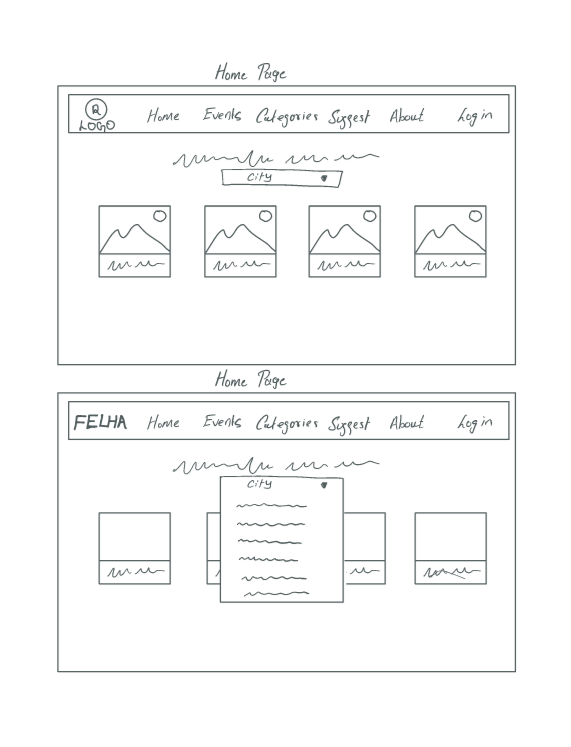
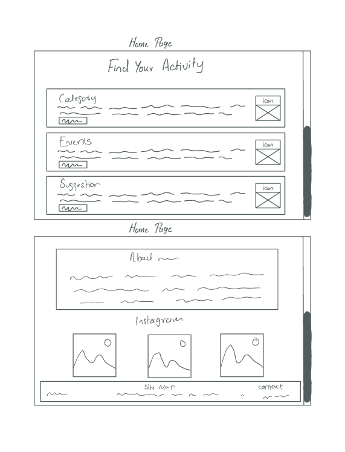
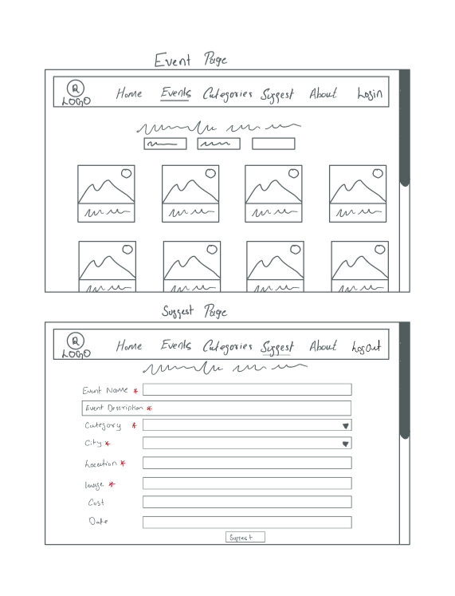
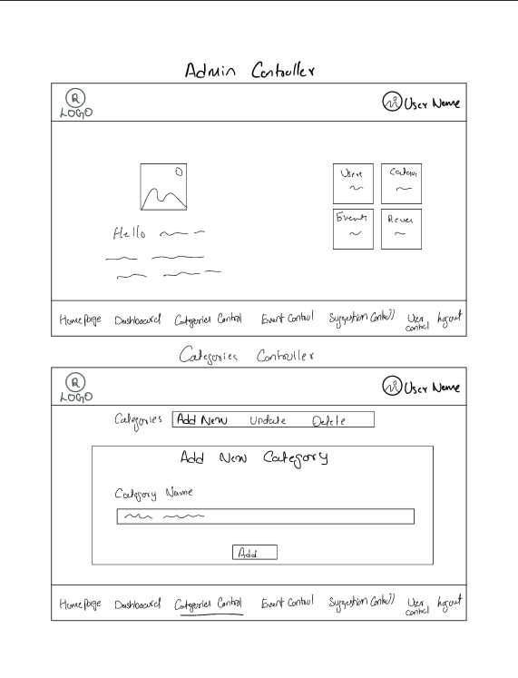
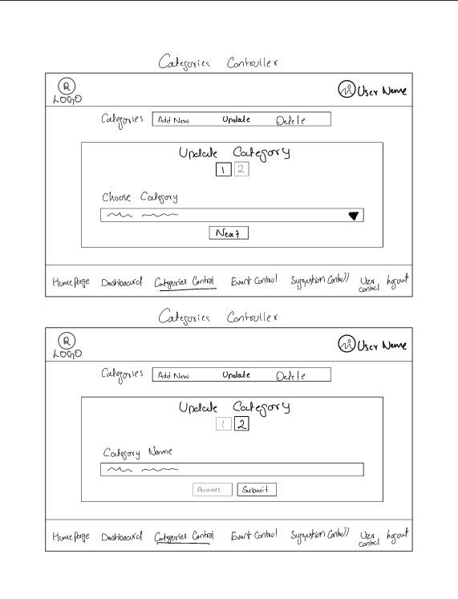
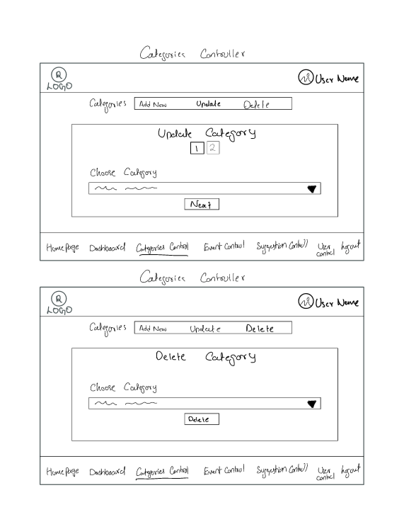
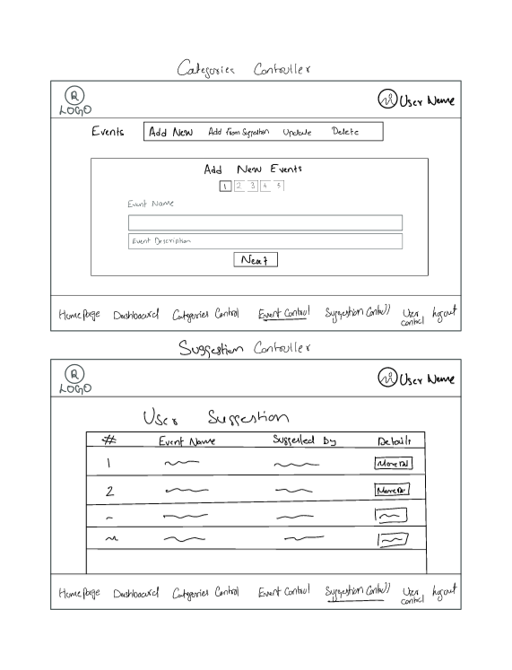
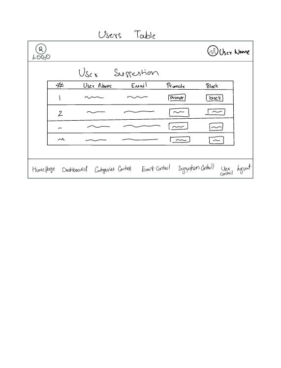

# Project-2

# Felha

**_Felha_**
is a website that helps people in Bahrain to find Events and Activities to do and places to go, such as beachs, education, cinemas, restaurants, museums, adventure activities and alot of different activities. It aims to provide users with a comprehensive platform to discover and explore various entertainment options in Bahrain.Features- Browse and search for restaurants, adventure activities, and other fun things to do in Bahrain.

- View detailed information about each activity, including descriptions, photos, contact details, and user reviews.
- Filter activities and events based on categories and locations, to find the perfect choice easier.
- Leave reviews and ratings for the places you've visited to share your experiences with the community.
- Login and create a user profile to personalize your experience and receive personalized recommendations.
- Get directions and navigate to your chosen destination using integrated maps.
  **Technologies Used**

1. Frontend: HTML, CSS, JavaScript
2. Backend: Node.js, Express.js
3. Database: MongoDB
4. Mapping: iFrame google maps
5. Authentication: Google and JSON Web Tokens (JWT)
6. Deployment: GitHub and Cyclic

- **Responsive mobile design**
  The website is designed to be responsive to different screen sizes using Botstrap Frame work.
- **Functionalities**
- Any User who enters the website can view the events and finds the events without the need to login.
- Users can find events more easeier either by selecting the city of the events or by choosing the category of the events.
- A list of available categories can be viewed to the user , they can click on the categories depending on their mode.
- Clicking on any event will show its details.
- Users can check on the rating of the events before taking their decision.
- To add any review and rating the user should login first.
- A list of available categories can be viewed to the user , they can click on the categories depending on their mood.
- The website is built in a way that it can accept events suggestions from users but they should login first to suggest.
- If a user suggested an events , the event shoult be accepted by admins in the admin controller .
- Super admin , admins , users and the blocked users are the types of users in our website .
- The admin page contains , category controls ,events controls , suggestion control and user control.
- In category control admin can add new , update and delete categories.
- In Events control , admin has the ability to add events ,update on available events ,update on a suggested events and delete events.
- In Suggested control , a list of the events suggested, each with their username.
- Admin can accept and reject any suggested events , by clicking on more details button to view the event detail and from their he can accept or reject the event.
- From user control, Admin can promote any user to be a an admin and block any user in the website.
- The website is connected with instagram were any post is added will be displayed in the website .
- The user can visit the website either by visiting the instagram and entering by the link in the bio or by scanning the Qrcode.
- **User Story**
- Ali on a hot sunny day was in a bad mood , he decided to go out but still he dont have any choices to visit , he entered Felha website and he has choosen sport from the categories and then he went to watch the final basketball match.
- Mohammed has gone to an event with his friends , were they enjoyed so He decided to visit felha website , and suggest that events in the website in order to be tried by others.
- Mahmood , an admin in the website has seen a review comments were the user uses bad words in his reviews ,so he decided to block the user.
- Noor has found a new event related to fashion , as an admin she straight away added the event to the website.
- **Successful and Error Alert**
- Any successful create ,update and delete a green message will be shown to inform users that the job done successfully.
- If any invalid inputs is entered a red message will be displayed with the error description.
- **Wire Frame**
  
  
  
  
  
  
  
  
- **Authors**
  Ali Abadi
  Noor Sharaf
  Natheer Hassan
  Mahmood Ahmed
